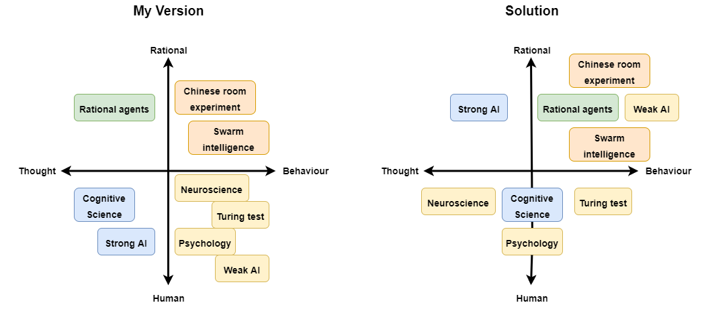

# Week 1 - Day 1
---
## 2.1 What is artificial intelligence?
### 2.1b How would you define ‘artificial intelligence'?
Artificial intelligence is an algorithm based on machine learning and neural networks that enables the program to analyse processes and learn from them.

### 2.1c Give three examples of AI applications. You can choose real-life examples, but also examples from popular culture (e.g., movies, books, video games etc.).
- Siri as an example for AI in Chatbots/Smart Assistants
- Google Search as an example of smart search recommendations
- Face recognition software in CCTV

##2.2 Philosophy of artificial intelligence
### 2.2b Define the following terms: ‘weak AI', and ‘strong AI'.
| Weak AI | Strong AI |
|---|---|
| (narrow AI) | (artificial general intelligence - AGI) |
| Weak AI is based on human made algorithms  that determine what specific should be performed.  This concept purely relies on data to insure accuracy  and provide a base for the relevant training. | Strong AI is a form of AI that focuses on algorithms  that mimic human learning processes. It is using meant  to be self-conscious with the ability to reason like a  human being. Although the concept for it exists already,  it is still not a reality. |

> Great additional source:
[IBM - Strong AI](https://www.ibm.com/cloud/learn/strong-ai)

### 2.2d What is the ‘Chinese room experiment'? Describe its procedure.
In the Chinese room experiment we have two people, Person 1 sitting inside the room and Person 2 sitting outside of the room. Person 1 cannot understand Chinese unlike Person 2. Person 1 is now given instruction papers on what character to respond when handed a Chinese text from Person 2. Person 1 can now find the characters from the text on the instruction paper and respond with the correlating characters. Person 1 can therefore communicate with Person 2 even though he doesn't speak Chinese.

### 2.2e What is the ‘Chinese room experiment' supposed to show? Select the correct statement, and elaborate on your choice:
- [ ] a) Computers are not yet able to simulate the human ability to understand

- [ ] b) Understanding involves more than the ability to formally reproduce appropriate outputs

- [ ] c) It is only possible for systems to demonstrate understanding

- [x] d) No machine can demonstrate genuine understanding

The Chinese room experiment shows, that machines perform tasks without understanding the output just like Person 1 did in the experiment.

### 2.2f Connect the Post It notes (Fig 2.) to the relevant quadrant in the philosophy matrix (Fig 3.). For example, A = 1, 2, and B = 3, 4, 5 etc. Elaborate on your choices.

~~- Human Behaviour
  - Neuroscience is studying the nervous system and for me therefore studies part of human behaviour
  - The Turing test is testing if a computer can be distinguishable from human behaviour in interactions
  - Psychology is the study of human behaviour
  - Weak AI is trying to mimic human Behaviour

- Human Thought
  - Cognitive Science is studying the process of acquiring knowledge and understanding through thought
  - Strong AI is the idea of machines being able to think and be conscious just like humans

 - Rational Behaviour
   - Swarm intelligence is a decentralized collective behaviour that is self-organized
   - The Chinese room experiment shows rational behaviour that just follows a task

- Rational Thought
  - Rational agents act upon given information and premises. They aim to perform actions with an optimal outcome. Rational agents are tightly connected to the field of cognitive science~~

### 3.2g After completing the readings and exercises of this section, would you provide the same answer to exercise 2.1b? Explain your answer.
I think I would still provide the same answer but I would elaborate more. The field of AI is very broad and even in this short introduction I was introduced to so many theories and aspects that I think its really hard to break it down into just one sentence.
